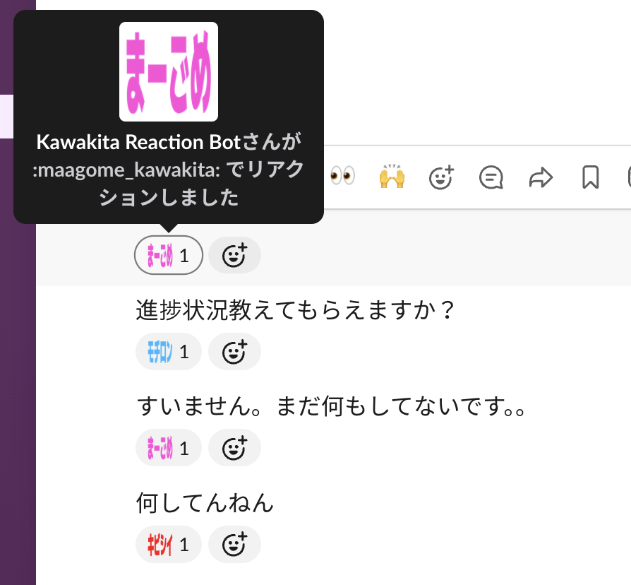

# kawakita-reaction-bot

Slackの人間による通常投稿をJevで判定し、候補からリアクションを1つ選んで付与するCloudflare Workerです。



## 動作

- Slack Events APIのHTTP Request URLでイベントを受信します。
- 公開チャンネル、非公開チャンネル、Botとの1対1 DM、Botを含む複数人DMを対象にします。
- Botが参加している会話に新しく投稿された、スレッドではない通常投稿だけを処理します。
- スレッド返信、編集、削除、ファイル共有、Bot投稿、その他のsubtype付き投稿は処理しません。
- Slack署名を検証し、URL Verificationに応答します。
- SlackへのACK後、`ctx.waitUntil()` でJev判定とリアクション付与を実行します。
- Slack再送ヘッダーがあるイベントはACKだけ返して処理しません。
- メッセージ本文はJevの判定のためTypeSafe AIへ送られます。Workerは本文を永続保存せず、ログにも出力しません。

Slack Appの説明にもTypeSafe AIへ投稿本文を送信することを記載しています。WorkerからTypeSafeへ送るのは本文だけで、ユーザーID、チャンネルID、ワークスペース情報は含めません。機密性の高い会話にはBotを追加しないでください。TypeSafe AIの一般向けポリシーでは、入力をモデル学習には使わない一方で、サービス提供に必要な期間保持する可能性があり、サービスは米国でホストされます。ゼロデータ保持を前提とした利用ではありません。

TypeSafeの現行モデル文書では、英語を主な学習言語とし、日本語を含むCJK言語の精度は英語より低いとされています。リアクション選択は誤る可能性があるため、その前提で運用してください。

## 必要なもの

- SlackワークスペースでSlack Appを作成・インストールできる権限
- CloudflareアカウントとWorkersをデプロイできる権限
- TypeSafe AI APIキー
- ワークスペースに登録済みの `maagome_kawakita`、`kibishii_kawakita`、`mochiron_kawakita` 絵文字
- Cloudflareが案内する現行のサポート対象Node.js LTSとnpm

## セットアップ

以下は2026-09-19に確認した各社公式ドキュメントを基準にしています。画面名やCLIの動作が変わる可能性があるため、設定時にもリンク先の現行手順を確認してください。

### 1. アプリを取得して型を生成する

```sh
npm ci
npm run cf-typegen
```

`wrangler.jsonc` がWorker設定の正本です。設定を変えたら `npm run cf-typegen` を再実行してください。

### 2. Slack Appを作る（第1段階）

1. Slackの **Your Apps → Create New App → From an app manifest** から、[`slack-app-manifest.json`](./slack-app-manifest.json) を使ってAppを作成します。
2. この初期Manifestには、Request URLとイベント購読を含めません。SlackはBotイベントを登録する時点でRequest URLまたはSocket Modeを要求するためです。このWorkerはHTTP Request URLを使い、Socket Modeは使いません。
3. Slack Appの **OAuth & Permissions** でワークスペースへインストールし、表示されたBot User OAuth Tokenを控えます。
4. **Basic Information** にあるSigning Secretを控えます。
5. Workerをデプロイしてから、第2段階としてRequest URLとイベント購読を設定します。

初期Manifestが要求するBot Token Scopeは `channels:history`、`groups:history`、`im:history`、`mpim:history`、`reactions:write` です。Scopeや権限を後から変更した場合は、Slack公式の手順に従ってAppを再インストールしてください。

Botは自分でチャンネルや複数人DMに参加しません。イベントの対象になるのはBotがメンバーとして参加している会話です。人間2名だけのDMは対象外で、Botを含む3者の会話とは別です。

### 3. ローカル用Secretsを用意する

`.dev.vars.example` を `.dev.vars` に複製し、実値を設定します。

```dotenv
SLACK_BOT_TOKEN=xoxb-...
SLACK_SIGNING_SECRET=...
TYPESAFE_API_KEY=...
```

`.dev.vars` はGit管理対象外です。実値をソース、README、Wranglerの `vars` に書かないでください。リアクション設定は秘密ではないため `wrangler.jsonc` の `REACTION_CONFIG` で管理します。

### 4. Cloudflare Workerをデプロイする

Wranglerにログインします。

```sh
npx wrangler login
```

初回デプロイ用に `.dev.vars.production` を作り、本番用の3つのSecretを記入します。このファイルも `.gitignore` 対象です。ローカル用と本番用で認証情報を分けてください。

```dotenv
SLACK_BOT_TOKEN=xoxb-...
SLACK_SIGNING_SECRET=...
TYPESAFE_API_KEY=...
```

SecretsをWorkerコードと一緒に登録して初回デプロイします。

```sh
npm run deploy -- --secrets-file .dev.vars.production
```

`wrangler secret put` は設定時点のWrangler仕様ではWorkerの新しいバージョンを作成して即時デプロイします。後から個別登録するときは、コマンド実行によるデプロイも発生する点に注意してください。Secretsの登録後、Wrangler出力に表示された `https://<worker>.<subdomain>.workers.dev` を控えます。

Slack Appの **App Manifest** を開き、`settings` の中に次の `event_subscriptions` を追加します。`<worker>` と `<subdomain>` はWrangler出力の値へ置き換えてください。

```json
"event_subscriptions": {
  "request_url": "https://<worker>.<subdomain>.workers.dev/slack/events",
  "bot_events": [
    "message.channels",
    "message.groups",
    "message.im",
    "message.mpim"
  ]
}
```

Slack App設定のManifestへ反映し、Events APIのRequest URLを検証します。成功するとSlackから届く `url_verification` のchallengeにWorkerが応答します。

検証後、公開・非公開チャンネルでは対象チャンネルへBotを招待します。1対1 DMではAppとのDMにメッセージを送ります。複数人DMでは会話にBotを追加します。

> `wrangler secret put` や `--secrets-file` による本番操作は実際のWorker設定とデプロイを変更します。値を入力・登録する前に対象アカウントとWorkerを確認してください。

### 5. ローカル開発

`.dev.vars` を用意した後、次のコマンドでローカルWorkerを起動できます。

```sh
npm run dev
```

SlackのHTTP Request URLからローカル環境へ直接接続はできません。Slackからイベントを受ける場合は、公開済みWorker URLをRequest URLとして設定してください。

### 6. 動作を検証する

#### デプロイ前の確認

Secretsを含まない範囲で、型とCloudflare向けバンドルを確認します。

```sh
npm ci
npm run cf-typegen
npm run typecheck
npm run deploy -- --dry-run
```

`--dry-run` はWorkerをCloudflareへ公開せず、バンドルと`wrangler.jsonc`の読み込みだけを確認します。`.dev.vars` に実値を設定した後で `npm run dev` を実行するとローカルWorkerを起動できますが、SlackからローカルURLへイベントを直接送ることはできません。

#### Slack接続後の確認

最初は専用のテスト用会話で確認してください。4種類すべてを使う場合は、それぞれにBotを追加してから投稿します。

| 会話 | 投稿例 | 期待結果 |
| --- | --- | --- |
| 公開チャンネル | `すみません、手順を間違えました` | `:maagome_kawakita:` が付く |
| 非公開チャンネル | `本番障害でかなり厳しいです` | `:kibishii_kawakita:` が付く |
| Botとの1対1 DM | `承知しました、対応します` | `:mochiron_kawakita:` が付く |
| Botを含む複数人DM | 各候補に近い通常投稿を1件ずつ送る | 対応するカスタム絵文字が1つ付く |

Jevの判定は確率的なため、文言が境界的な投稿では期待した候補と異なる場合があります。各候補の検証には、表のように意味が明確な文を使ってください。

次の投稿にはリアクションが付かないことも確認します。

- 通常投稿へのスレッド返信
- Botが投稿したメッセージ
- 通常投稿を編集したときに発生する更新イベント
- ファイル共有など、`subtype` を持つイベント

公開Worker URLをRequest URLに設定した直後は、Slackの画面でURL Verificationが成功することを確認します。イベントが届いているか、または外部APIの失敗理由を確認するときは、別ターミナルで次を実行します。

```sh
npx wrangler tail kawakita-reaction-bot --format pretty
```

ログには`event_id`、処理段階、正規化したエラーコードだけが出力されます。投稿本文、Slackトークン、TypeSafe APIキーが出力されないことを確認してください。

## 設定

リアクション候補、判断指示、Slack絵文字名は `wrangler.jsonc` の `REACTION_CONFIG` で設定します。JSON文字列の形は次のとおりです。

```json
{
  "instruction": "Slackメッセージに対して、最も自然なリアクションを1つ選んでください。\n\n- **まーごめ**：謝罪・ミス・やらかし・気まずさ\n- **ｷﾋﾞｼｲ**：困難・問題・驚き・つらい状況\n- **ﾓﾁﾛﾝ**：肯定・同意・了承・前向きな返答\n\n単語ではなく、メッセージ全体の意味で判断してください。",
  "options": [
    {
      "id": "maagome",
      "slackEmoji": "maagome_kawakita",
      "description": "謝罪・ミス・やらかし・気まずさ"
    },
    {
      "id": "kibishii",
      "slackEmoji": "kibishii_kawakita",
      "description": "困難・問題・驚き・つらい状況"
    },
    {
      "id": "mochiron",
      "slackEmoji": "mochiron_kawakita",
      "description": "肯定・同意・了承・前向きな返答"
    }
  ]
}
```

`id` はJevからの選択値で、`slackEmoji` はSlack Web APIへ渡す名前です。設定の変更後もソースコードを変更する必要はありません。

## 開発コマンド

```sh
npm run dev
npm run cf-typegen
npm run typecheck
npm run deploy
```

`npm run deploy` はCloudflareへデプロイします。本番Secretsの登録を含める初回デプロイでは、上記セットアップ手順の `--secrets-file` を使用してください。

## 公式ドキュメント

2026-09-19確認。

- [Slack App Manifest](https://docs.slack.dev/reference/app-manifest/)
- [Slack App Manifests](https://docs.slack.dev/app-manifests/)
- [Slack Events API](https://docs.slack.dev/apis/events-api/)
- [Slack request signature verification](https://docs.slack.dev/authentication/verifying-requests-from-slack/)
- [Slack `message` event](https://docs.slack.dev/reference/events/message/)
- [Slack `reactions.add`](https://docs.slack.dev/reference/methods/reactions.add/)
- [Cloudflare Workers CLI quickstart](https://developers.cloudflare.com/workers/get-started/guide/)
- [Wrangler configuration](https://developers.cloudflare.com/workers/wrangler/configuration/)
- [Cloudflare Worker Secrets](https://developers.cloudflare.com/workers/configuration/secrets/)
- [Cloudflare Workers TypeScript](https://developers.cloudflare.com/workers/languages/typescript/)
- [Cloudflare Workers `waitUntil`](https://developers.cloudflare.com/workers/runtime-apis/context/)
- [Cloudflare Workers Vitest integration](https://developers.cloudflare.com/workers/testing/vitest-integration/)
- [TypeSafe AI API](https://docs.typesafe.ai/api)
- [TypeSafe AI models](https://docs.typesafe.ai/models)
- [TypeSafe AI data handling policy](https://typesafe.ai/legal/privacy-policy)
